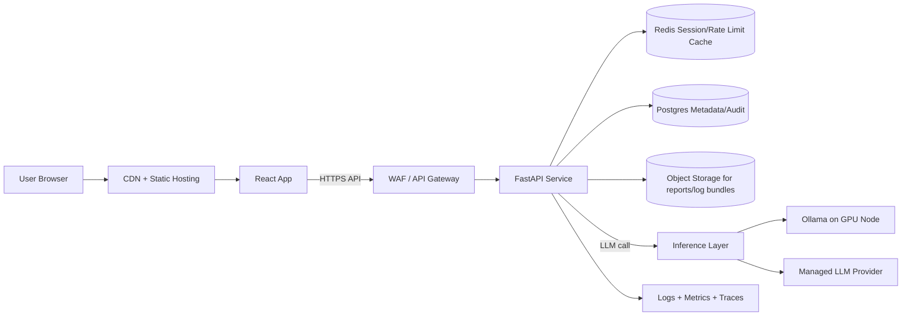

# ChatLawAI Deployment Architecture (End-to-End)

## 1. Document Purpose

This document defines an end-to-end deployment architecture for ChatLawAI, covering:

- Frontend hosting
- Backend API hosting
- AI inference path (Ollama/local model and managed alternatives)
- Data, logs, monitoring, and security controls
- CI/CD pipelines
- Environments and release workflow
- Operational readiness and go-live checklist

The design is aligned to the current repository structure:

- Frontend: Vite + React
- Backend: FastAPI (`backend/app.py`)
- AI flow: embeddings + legal analysis with optional Ollama model endpoint

## 2. Current Application Topology (As-Is)

### 2.1 Frontend

- Static SPA built with Vite (`npm run build`)
- API base URL currently hardcoded in frontend service as `http://localhost:8000`

### 2.2 Backend

- FastAPI service on port 8000
- Endpoints:
  - `GET /`
  - `POST /consult/start`
  - `POST /consult/answer`
- CORS currently open (`allow_origins=["*"]`)

### 2.3 AI and Retrieval

- Uses sentence-transformers embeddings in process
- Optional local Ollama endpoint (`http://localhost:11434`) for LLM completion
- Optional FAISS usage if installed

### 2.4 Runtime Considerations

- Python dependencies include heavy ML packages (`torch`, `transformers`, `sentence-transformers`)
- Cold start and memory footprint are significant
- Response latency can vary based on model path and host resources

## 3. Target Production Architecture (Recommended)

### 3.1 High-Level Diagram

### 3.2 Production Components

1. Client Delivery Layer
- Host Vite build on CDN-backed static hosting (Cloudflare Pages, Vercel, Netlify, or S3 + CloudFront)
- Enable immutable asset caching and compression

2. API Layer
- Deploy FastAPI as containerized service behind API Gateway / reverse proxy
- Use at least 2 replicas for high availability
- Use health checks and rolling deployments

3. Inference Layer
- Primary option: dedicated model service (Ollama on GPU VM/node pool)
- Fallback option: managed LLM API for resilience and cost control
- Route model calls through an inference abstraction in backend

4. Data Layer
- Redis for short-lived session state, request throttling counters
- Postgres for long-lived metadata, audit trail, optional session transcript persistence
- Object storage for archived generated reports and troubleshooting artifacts

5. Observability Layer
- Structured logs (JSON)
- Metrics: request count, p95/p99 latency, error rate, token/model call duration
- Tracing across frontend request -> API -> model call

6. Security Layer
- WAF rules and rate limiting at edge
- TLS everywhere
- Secrets in managed secret store (not in repo)

## 4. Environment Strategy

Use 4 environments:

1. Local
- Developer machine, optional local Ollama

2. Dev
- Shared integration environment
- Lower-cost model option

3. Staging
- Production-like scale and security controls
- Full pre-release validation

4. Production
- Hardened, monitored, autoscaled

Each environment should have isolated:

- API URL
- model provider credentials
- database and cache instances
- storage buckets

## 5. Network and Request Flow

### 5.1 Consultation Start Flow

1. Browser calls `POST /consult/start`
2. API validates payload and initializes session context
3. API performs classification and entity extraction
4. API optionally calls inference backend for partial analysis
5. API returns `session_id`, `question`, and optional `partial_report`

### 5.2 Consultation Answer Flow

1. Browser calls `POST /consult/answer` with `session_id`
2. API fetches session state, updates extracted entities
3. API computes next question or final report
4. API calls model service as needed
5. API returns either:
- `next_action=ask` with next question
- final structured report payload

## 6. Configuration and Secrets

### 6.1 Backend Environment Variables

Recommended backend env vars:

- `APP_ENV` (`dev|staging|prod`)
- `API_HOST` (default `0.0.0.0`)
- `API_PORT` (default `8000`)
- `ALLOWED_ORIGINS` (comma-separated trusted frontend origins)
- `OLLAMA_URL` (if self-hosted model)
- `OLLAMA_MODEL`
- `LLM_PROVIDER` (`ollama|managed`)
- `LLM_API_KEY` (if managed)
- `REDIS_URL`
- `DATABASE_URL`
- `LOG_LEVEL`
- `REQUEST_TIMEOUT_SECONDS`
- `RATE_LIMIT_PER_MINUTE`

### 6.2 Frontend Environment Variables

- `VITE_API_BASE_URL` (production API URL)

Note: Current frontend API URL is hardcoded to localhost. For deployment, switch to environment-driven config.

## 7. Containerization Blueprint

### 7.1 Backend Container

Use multi-stage Docker build:

1. Base stage with Python runtime
2. Dependency install stage with pinned requirements
3. Runtime stage with non-root user

Runtime command:

- `uvicorn app:app --host 0.0.0.0 --port 8000 --workers 2`

### 7.2 Frontend Container (Optional)

For static hosting, containerization is optional. If using Kubernetes-only deployment, build SPA and serve with Nginx.

### 7.3 Recommended First Production Topology

- Frontend: Vercel/Netlify/Cloudflare Pages
- Backend: Render/Fly.io/Railway or Kubernetes service
- Model server: dedicated GPU VM (if Ollama kept)

## 8. CI/CD Pipeline (GitHub Actions Suggested)

### 8.1 Frontend Pipeline

On push to main:

1. Install dependencies
2. Run lint/tests (if present)
3. Build Vite assets
4. Deploy to static hosting
5. Smoke test homepage and API connectivity

### 8.2 Backend Pipeline

On push to main:

1. Setup Python
2. Install dependencies
3. Run backend tests (`backend/test_full_flow.py` adapted for CI mock)
4. Build container image
5. Push image registry
6. Deploy to staging
7. Run post-deploy smoke tests on `/` and consultation endpoints
8. Promote to production after checks pass

### 8.3 Release Strategy

- Use blue/green or canary rollout for backend
- Keep fast rollback to previous container digest

## 9. Security Architecture

### 9.1 Edge and Transport

- Enforce HTTPS with modern TLS
- Enable HSTS
- Add WAF managed rule sets

### 9.2 API Hardening

- Restrict CORS to known frontend domains
- Add per-IP and per-session rate limits
- Validate request body size and timeouts
- Add API auth if app is not intended to be public anonymous

### 9.3 Secrets and Data

- Store credentials in cloud secret manager
- Rotate keys periodically
- Encrypt data at rest (DB/object store)
- Mask PII in logs where possible

### 9.4 AI Safety Controls

- Add prompt injection safeguards
- Add content safety filtering for generated output
- Keep audit logs for generated legal suggestions

## 10. Observability and SRE Baseline

### 10.1 Metrics

- API request count, 4xx/5xx rates
- p50/p95/p99 latency by endpoint
- model call latency and failure rate
- queue depth or concurrency saturation

### 10.2 Logging

- Structured JSON logs
- Include request id, session id, environment, endpoint
- Avoid storing full raw sensitive user statements in unrestricted logs

### 10.3 Alerting

Create alerts for:

- Error rate > 2% over 5 minutes
- p95 latency above threshold
- model endpoint unavailable
- memory/CPU saturation

## 11. Performance and Scaling

### 11.1 API Scaling

- Horizontal autoscaling based on CPU and request concurrency
- Keep stateless API replicas; externalize session state to Redis if multi-instance

### 11.2 Model Scaling

- Separate model inference service from API for independent scaling
- Use request timeouts and circuit breaker behavior
- Cache repeated embedding/model results where valid

### 11.3 Capacity Planning

Define target SLOs, for example:

- Availability: 99.9%
- p95 API latency (non-final responses): < 2.5s
- p95 final report latency: < 15s (depends on model)

## 12. Cost Model Guidance

### 12.1 Low-Cost Launch

- Static frontend on CDN provider free tier
- Single backend instance
- Managed LLM pay-per-use (no dedicated GPU)

### 12.2 Growth Stage

- 2+ backend replicas
- Redis + Postgres managed services
- dedicated inference node for predictable latency

### 12.3 Enterprise Stage

- Multi-AZ deployment
- dedicated observability stack
- private networking and stricter compliance controls

## 13. Disaster Recovery and Rollback

1. Maintain daily DB backups and tested restore plan
2. Version object storage artifacts
3. Keep last known good backend image for immediate rollback
4. Run quarterly restore drills

## 14. Implementation Plan (Phased)

### Phase 1: Deployable MVP (1-2 weeks)

1. Externalize frontend API URL with `VITE_API_BASE_URL`
2. Containerize backend
3. Deploy frontend + backend with HTTPS
4. Restrict CORS
5. Add basic monitoring and health checks

### Phase 2: Production Hardening (2-4 weeks)

1. Add Redis + persistent metadata storage
2. Add secret manager integration
3. Add CI/CD with staging gate and smoke tests
4. Add rate limiting and WAF

### Phase 3: Scale and Reliability (ongoing)

1. Inference service isolation and autoscaling
2. SLO-driven alert tuning
3. Cost-performance optimization by traffic profile

## 15. Go-Live Checklist

- Frontend uses production API base URL
- Backend CORS is restricted to allowed origins
- TLS certificates valid and auto-renewing
- Secrets injected from secret manager
- Health endpoint and synthetic checks working
- Error monitoring and alerts configured
- Backup/restore tested
- Rollback plan documented and rehearsed
- Load test run with expected peak traffic

## 16. Recommended Next Repository Changes

For this codebase, the highest-impact deployment changes are:

1. Move frontend base URL to env-driven config
2. Add Dockerfile(s) and docker-compose for local parity
3. Add production config module for backend settings
4. Add CI workflow files for frontend and backend
5. Replace permissive CORS with environment-based allowlist

---

This architecture is designed to let you deploy quickly, then harden safely as usage grows.